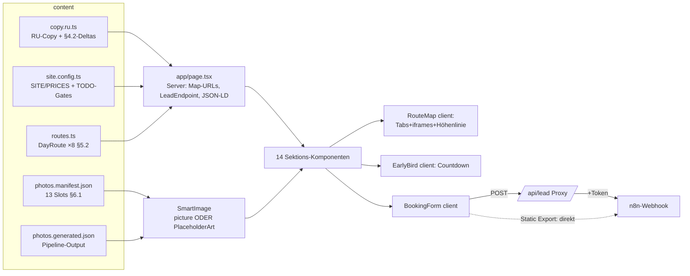

# ARCHITECTURE — maria-schroeder-sicily

> Stack-Entscheidungen, Datenmodelle, ENV (HANDOVER §1). Stand 2026-06-10.

## Stack (umgesetzt)

| Bereich | Entscheidung | Anmerkung |
|---|---|---|
| Framework | Next.js **15.5** (App Router, TS, React 19) | `create-next-app@15`-Basis |
| Styling | Tailwind **v4** (`@theme`-Tokens = §3-Palette wörtlich) + Komponenten-Klassen in `globals.css` (eyebrow, btn, chip, faq, grain) | keine UI-Kits |
| Fonts | `next/font/google`: Prata 400 · Manrope (variabel) · Cormorant Garamond 500/600 italic — alle `subsets:['cyrillic','latin']`, self-hosted | Google-Fonts-Hosts waren in der Build-Umgebung erreichbar |
| Bilder | **`<picture>` mit vorgenerierten AVIF/WebP/JPEG-srcsets statt `next/image`** | bewusste Abweichung: `next/image`-Optimizer ist mit `output:'export'` nicht nutzbar; die sharp-Pipeline (§6.3) erzeugt ohnehin alle Formate/Breiten + LQIP → identische Perf, beide Deploy-Pfade identisch. `images.unoptimized` gesetzt |
| Maps | Embed API v1 `directions` (Key) mit **automatischem Keyless-Fallback** (`maps.google.com…output=embed`) | URL-Bau serverseitig (`lib/maps.ts`) → Key braucht kein `NEXT_PUBLIC_` |
| Forms | Client-POST → je nach Build: `/api/lead`-Proxy (Server-Deploy, Token bleibt serverseitig) **oder** direkt an n8n (Static Export, Token wird Build-inlined) | Entscheidung zur Build-Zeit in `app/page.tsx` (`resolveLeadEndpoint`) |
| Analytics | `<script defer>`-Slot nur bei gesetztem `NEXT_PUBLIC_ANALYTICS_URL` | cookielos (Plausible/Umami) |
| Deployment | beide Pfade baubar: `next build` und `STATIC_EXPORT=1` (D2 offen) | `scripts/build-static.mjs` parkt `app/api` während des Export-Builds (POST-Handler sind mit `output:'export'` nicht erlaubt) |

## Daten- & Render-Fluss



## Datenmodelle

```ts
// content/routes.ts (§5.2)
type Stop     = { label: string; query: string };           // query = Maps-Suchstring
type DayRoute = { id: 'overview'|'d1'…'d7'; tab; title; altitude;
                  mode: 'driving'|'walking'; stops: Stop[]; driveNote };

// content/photos.manifest.json (§6.1)
type PhotoSlot = { id; ratio: '3:2'|…; minWidth; motif; queries: string[];
                   altRu; mood: 'basalt'|'ember'|'garnet'|'sea'|'paper'|'gold' };

// content/photos.generated.json (Output build-images.mjs)
type GeneratedImage = { widths: number[]; aspect; lqip: dataURI; formats };
type PhotoCredit    = { slot; title; author; license; sourceUrl };

// Lead-Payload (§7.2, fix)
{ source:'landing-sicily-2026', name, country, guests, messenger,
  contact, tariff, note, ts:number, token? }   // + honeypot 'website' (nur Transport)
```

## ENV (`.env.example`)

| Variable | Verwendung |
|---|---|
| `GOOGLE_MAPS_EMBED_KEY` | Embed-Directions; fehlt er → Keyless-Fallback. Im Cloud Console auf HTTP-Referrer einschränken |
| `N8N_WEBHOOK_URL`, `N8N_TOKEN` | Lead-Ziel; Server-Build: nur serverseitig; Static Export: Build-inlined (Token = Routing-Token, kein Geheimnis) |
| `UNSPLASH_ACCESS_KEY` | optionale Foto-Quelle (Stufe 3, §6.2) |
| `NEXT_PUBLIC_ANALYTICS_URL` / `…_DOMAIN` | optionales cookieloses Analytics |
| `NEXT_PUBLIC_SITE_URL` | kanonische URL bis D1/R9 entschieden |
| `STATIC_EXPORT=1` | nur durch `build-static.mjs` gesetzt |

## Foto-Pipeline (§6)

```
photos.manifest.json ──▶ scripts/source-photos.mjs ──▶ /tmp/photo-candidates/{slot}/ (+meta.json)
   (Presskits assets/press-kits/ ▸ Wikimedia Commons [CC0/PD/CC BY/CC BY-SA] ▸ Unsplash)
Sichtung (Bilder ansehen!) ──▶ assets/photos-src/{slot}.{ext} + {slot}.credit.json
scripts/build-images.mjs ──▶ public/images/{slot}/… (AVIF/WebP/JPEG ×480/960/1600/2400 + LQIP)
                         ──▶ content/photos.generated.json ──▶ SmartImage rendert <picture>
                         ──▶ content/credits.md ──▶ Route /credits
```

Bis ein Slot belegt ist, rendert `SmartImage` **PlaceholderArt** (mood-basierte
Gradients + Konturlinien + Slot-Beschriftung) — bewusst gestaltet, aber laut
DoD nicht der Endstand (KANBAN B1).

## Bewusste Abweichungen vom Handover (mit Grund)

1. **`<picture>` statt `next/image`** — s. o. (Static-Export-Kompatibilität); Perf-Ziele werden über die eigene srcset-Pipeline erfüllt.
2. **Bootstrap im falschen Repo:** Die Build-Session war auf `Angebot_TS` festgelegt → Projekt entstand dort als Unterordner und wurde am 2026-06-10 per `git subtree split` (volle Historie) in sein eigentliches Repo **`kryptobux/Maria`** überführt.
3. **KANBAN/ARCHITECTURE/HANDOFF liegen im Projekt** (hier im Repo-Root von kryptobux/Maria) — getrennt von den Boards des Bestandsprojekts in Angebot_TS.
